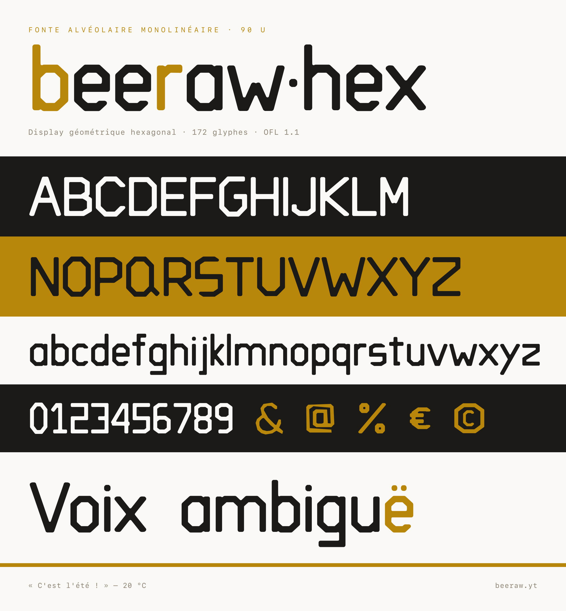

# Beeraw Hex

<picture>
  <source media="(prefers-color-scheme: dark)" srcset="images/specimen-dark.png">
  
</picture>

A geometric, strictly **monolinear** display sans, derived from the hexagonal
*alveole* cells of the beeraw honey-brand logo. Flat-topped / flat-bottomed
hexagonal cells, vertical side edges, bevelled and rounded corners.

- **Version:** 2.007 · four masters across two axes
- **Scope:** French / Western-European Latin — ASCII, digits, punctuation,
  guillemets, `œ æ Œ Æ`, the full set of French accents, math signs and
  `€ © ® § ¢ £ ¥ …`
- **License:** SIL Open Font License 1.1, Reserved Font Name *"Beeraw Hex"*
  (see [`OFL.txt`](OFL.txt))

## Two axes, one monoline

| family | style | stroke | width |
| --- | --- | --- | --- |
| **Beeraw Hex** | Regular / Bold | 90 u / 130 u | normal |
| **Beeraw Hex Wide** | Regular / Bold | 90 u / 130 u | ×1.35 |

The **weight** axis thickens the monoline (90 → 130 u). The **width** axis grows
the round half-widths and the spacing by a factor **without touching the
stroke**. Because every stem is drawn as a fixed-width bar, neither axis can
break the monoline: the perpendicular stroke stays at its nominal value at any
width, by construction. Each width is its own RIBBI family, so Regular and Bold
link and the bold toggle works within it.

## Install

Grab a file from [`fonts/`](fonts/):

| Use | Normal | Wide |
| --- | --- | --- |
| Desktop (hinted) | `BeerawHex-Regular.ttf` · `BeerawHex-Bold.ttf` | `BeerawHexWide-Regular.ttf` · `BeerawHexWide-Bold.ttf` |
| Desktop (CFF) | `BeerawHex-*.otf` | `BeerawHexWide-*.otf` |
| Web | `BeerawHex-*.woff2` (+ `.woff`) | `BeerawHexWide-*.woff2` (+ `.woff`) |

```css
@font-face {
  font-family: "Beeraw Hex";
  src: url("BeerawHex-Regular.woff2") format("woff2"),
       url("BeerawHex-Regular.woff")  format("woff");
  font-weight: 400;
  font-display: swap;
}
@font-face {
  font-family: "Beeraw Hex";
  src: url("BeerawHex-Bold.woff2") format("woff2"),
       url("BeerawHex-Bold.woff")  format("woff");
  font-weight: 700;
  font-display: swap;
}
```

Declare `"Beeraw Hex Wide"` the same way with the `BeerawHexWide-*` files.

See [`specimen.html`](specimen.html) for the full, self-contained type specimen
(all four masters embedded). The banner above is rendered from the shipped TTF
by `tools/make_readme_image.py` (headless Chrome → `images/`).

## Source-first

The files in `fonts/` are build artifacts — regenerated from source, never
edited by hand. There are two build paths:

- the **base Regular** ships *normalised* (ccmp / gasp / GDEF / hinting, plus a
  few extra Latin glyphs) and is built from the UFO
  **`sources/BeerawHex-Regular.ufo`** by `tools/pipeline.sh`;
- the **other three masters** come straight from the parametric generator
  **`font_build.py`**, whose `MASTERS` table is the single place where stroke
  (`stroke`) and width (`width_factor`) are defined.

```
font_build.py              # parametric generator: the MASTERS table (both axes)
sources/
  BeerawHex-Regular.ufo    # normalised source for the base Regular
  features.fea             # OpenType features (ccmp, kern, marks)
  baseline.ttf             # frozen baseline the genesis pipeline reconstructs the UFO from
  ampersand.json           # vectorised design inputs…
  arobase.json / .png      #   …and their reference drawings
  cedille.json / .png
  esperluette.png
features/kern.fea          # GPOS kerning
tools/                     # build + QA pipeline (see below)
fonts/                     # BUILD ARTIFACTS (ttf / otf / woff2 / woff), 4 masters
specimen.html              # self-contained type specimen
qa/NOTES.md                # fontbakery WARN justifications
OFL.txt / OFL-FAQ.txt      # SIL Open Font License 1.1
FONTLOG.txt                # changelog
.github/workflows/         # CI: build + monoline gate + fontbakery
```

## Build

```bash
python3 -m venv .venv && source .venv/bin/activate
pip install -r tools/requirements.txt
```

Generator masters (Bold, Wide, Wide Bold) — `tools/build.sh` builds them all,
packages the web fonts and refreshes the specimen:

```bash
tools/build.sh
python font_build.py Wide      # …or rebuild a single master
```

Base Regular — edit `sources/BeerawHex-Regular.ufo`, then:

```bash
python tools/build.py --tol 1.0                       # UFO -> build/BeerawHex-Regular.ttf (hinted)
cp build/BeerawHex-Regular.ttf fonts/                 # promote to the shipped TTF
python tools/make_webfonts.py fonts/BeerawHex-Regular.ttf   # -> .otf + .woff2 + .woff
```

`tools/pipeline.sh` runs the full deterministic genesis (reconstruct the UFO
from the baseline TTF → add monoline Latin glyphs → normalize → fix kinks →
prepare tables → build + hint into `build/`). After changing glyph geometry in
the generator, re-pin the baseline so the fix reaches the normalised Regular:

```bash
python -c "import font_build as fb; fb.build_font('sources/baseline.ttf', fb.MASTERS['Regular'])"
tools/pipeline.sh && cp build/BeerawHex-Regular.ttf fonts/
```

`font_build.py` refuses to overwrite a normalised master unless you pass
`--force`, so a stray run cannot silently regress the shipped Regular.

## The monoline is the DNA

The perpendicular stroke must stay at its master's nominal value everywhere —
**90 u** at Regular weight, **130 u** at Bold, *whatever the width* (measured by
distance transform, not horizontal scan). `tools/qa_monoline.py` reads that
nominal from the font itself (`post.underlineThickness`) and fails the build if
a glyph's median band leaves the **W-1.5 … W+1.9 u** window, so the Regular
keeps its historical 88.5–91.9 gate. All four masters pass; any cleanup must
keep the gate green.

```bash
python tools/qa_monoline.py fonts/BeerawHex-Regular.ttf   # monoline non-regression
python tools/audit.py       fonts/BeerawHex-Regular.ttf   # structural audit
```

CI ([`.github/workflows/font-qa.yml`](.github/workflows/font-qa.yml)) runs the
build, the monoline gate and `fontbakery` (Google Fonts profile) on every push
that touches `sources/`, `features/` or `tools/`. One `fontbakery` check is
allow-listed in `tools/ci_gate.py`: `glyph_coverage` — the font deliberately
targets French/Western-European Latin, not the full GF Latin Core.
